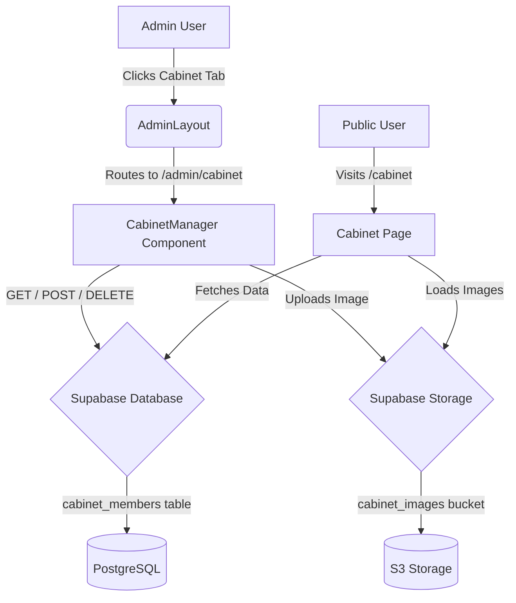

# Cabinet Management Feature - Architecture Design

## Problem Statement
The VSA website's Cabinet page currently renders hardcoded member data directly from the frontend React component. This requires a developer to manually update the source code every academic year or when board details change. We need a dynamic "Cabinet" management tab within the existing Admin Dashboard allowing admins to upload, update, and delete photos and metadata for Cabinet members without touching code.

## Proposed Solution
1. **Database Expansion**: Create a new `cabinet_members` table in Supabase to store member metadata (name, role, category, year, major, etc.).
2. **Storage**: Configure a new Supabase Storage bucket (`cabinet_images`) for uploading and serving member headshots.
3. **Admin Dashboard UI**: Implement a new `CabinetManager` component with a grid view, "Add Member" modal, edit forms, and image upload capabilities.
4. **Routing**: Add a `/admin/cabinet` route within the existing React Router setup.
5. **Frontend Update**: Refactor the public `Cabinet.tsx` page to fetch and render data dynamically from Supabase instead of using the hardcoded arrays.

## System Architecture



## API / Interface Definitions

### 1. Database Schema (`cabinet_members`)
```sql
CREATE TABLE public.cabinet_members (
  id uuid PRIMARY KEY DEFAULT gen_random_uuid(),
  name text NOT NULL,
  role text NOT NULL, -- e.g., 'Co-President', 'Intern'
  category text NOT NULL, -- 'Executive Board', 'General Board', or 'Interns'
  display_order integer NOT NULL DEFAULT 0,
  image_url text,
  year text,
  college text,
  major text,
  minor text,
  pronouns text,
  favorite_snack text,
  fun_fact text,
  created_at timestamptz DEFAULT now()
);
```

### 2. Storage Bucket
- **Bucket ID**: `cabinet_images`
- **Policies**: Public read access; Authenticated write/delete/update access.

### 3. Frontend Routes & Navigation
- **`src/routes/index.tsx`**: Add `Route path="/admin/cabinet" element={<AdminCabinet />}` wrapped inside the existing `AdminRoute`.
- **`AdminLayout.tsx`**: Append `{ id: 'cabinet', label: 'Cabinet', path: '/admin/cabinet' }` to the `tabs` array.

### 4. Admin API Handlers (Supabase Client methods)
- `fetchCabinetMembers()`: `supabase.from('cabinet_members').select('*').order('display_order')`
- `addCabinetMember(data)`: `supabase.from('cabinet_members').insert(data)`
- `updateCabinetMember(id, data)`: `supabase.from('cabinet_members').update(data).eq('id', id)`
- `deleteCabinetMember(id)`: `supabase.from('cabinet_members').delete().eq('id', id)`
- `uploadCabinetImage(file)`: `supabase.storage.from('cabinet_images').upload(path, file)`

## Edge Cases & Limitations
- **Image Sizing**: Admins may upload very large files. The UI should constrain uploads (e.g., max 2MB) and optimally use responsive image rendering via ``.
- **Sorting Logic**: Members need to be grouped by `category` (Exec, General, Intern) and then sorted by `display_order` or `role`. We will implement a `display_order` integer to give admins manual control over sorting.
- **Orphaned Images**: Deleting a cabinet member should also delete their associated image from the Supabase bucket to prevent storage bloat.
- **Google Drive Links**: The current hardcoded data utilizes some Google Drive (`uc?id=`) links. For the migration, these will be stored directly as string URLs until re-uploaded cleanly via Storage.
