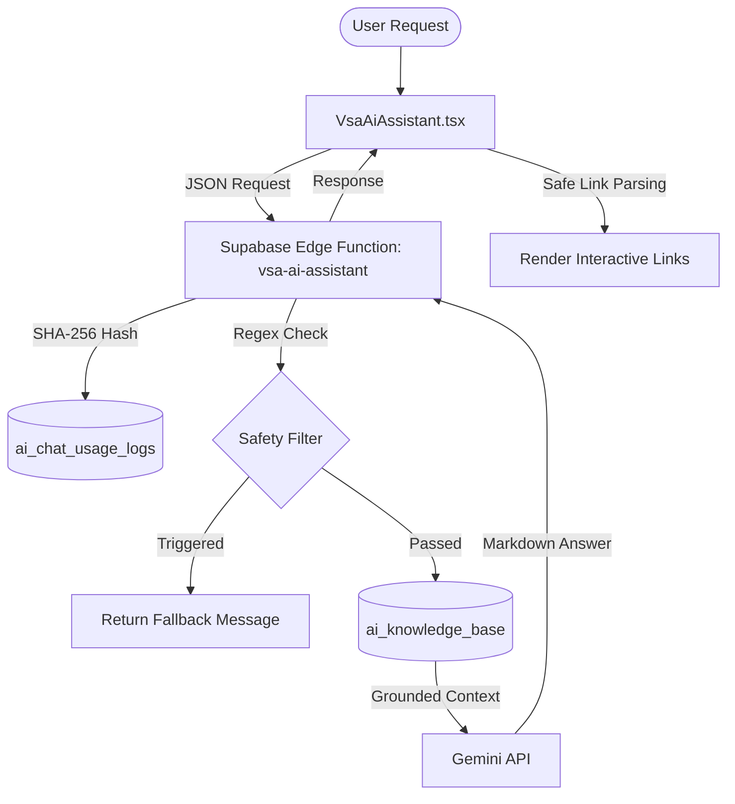

# Ask VSA AI Assistant Architecture & Privacy

This document outlines the architecture, safety filters, privacy safeguards, and link rendering of the Ask VSA AI assistant.

---

## 1. System Architecture

The Ask VSA assistant is a closed-loop Q&A agent that uses Gemini (`gemini-3.1-flash-lite` by default) to answer student questions using VSA-specific public information.

* **Frontend UI Component:** [VsaAiAssistant.tsx](file:///Users/havyn/Documents/CS/vsa-website/src/components/features/ai/VsaAiAssistant.tsx)
* **API Endpoint (Edge Function):** [index.ts](file:///Users/havyn/Documents/CS/vsa-website/supabase/functions/vsa-ai-assistant/index.ts)
* **Knowledge Database Table:** `ai_knowledge_base`
* **RPC Grounding Function:** `match_ai_knowledge_base` (semantic search query vector matcher)
* **Usage Database Logs:** `ai_chat_usage_logs`
* **Feedback Logging:** `ai_feedback` table

---

## 2. Privacy & Data Guardrails

Ask VSA enforces strict data boundaries to ensure no sensitive, private, or admin-only information is exposed.

### Hashed Usage Logging (No PII)
- Client IP addresses and session IDs are hashed using a server-side **SHA-256** function before querying rate limits or writing logs.
- The raw text of conversations is **never stored** in the database usage log (`ai_chat_usage_logs`), maintaining full anonymity.

### Edge Function Safety Interceptors
The Edge Function uses regex checks in `asksForSensitivePrivateInfo()` to block input containing:
- Check-in codes or event attendance codes.
- Admin secrets, passwords, database names, or credentials.
- Environment variables or service keys.
- Requests for individual member emails, phone numbers, or rosters.
- Request records or private Drive storage links.

### System Prompt Constraints
The `SYSTEM_PROMPT` enforces:
- Answering strictly from the grounded knowledge snippets.
- Refusing to invent deadlines, event locations, point values, or dates if missing.
- Polite refusal when asked for private lineage details or roster entries, redirecting to the official VSA website pages.

---

## 3. Safe Link Rendering

Gemini outputs route suggestions in standard markdown format: `[Link Label](/path)`. The React frontend parses these links safely:
1. **Internal Routes:** Regex matches `[Label](/route)` and compiles them into React Router `<Link to="/route">` tags. This enables instantaneous, single-page transitions.
2. **External Routes:** HTTP/HTTPS links are compiled into `<a href="url" target="_blank" rel="noopener noreferrer">` tags.
3. **Safety Protection:** Scheme matching blocks arbitrary javascript (`javascript:` code execution) or raw unescaped HTML injection.

---

## 4. Fallback Mechanics

When live database data is unreachable, or when the AI does not find relevant public context, the assistant responds with:
> "Some live site data is unavailable right now. Check Instagram or Linktree for the newest updates."
