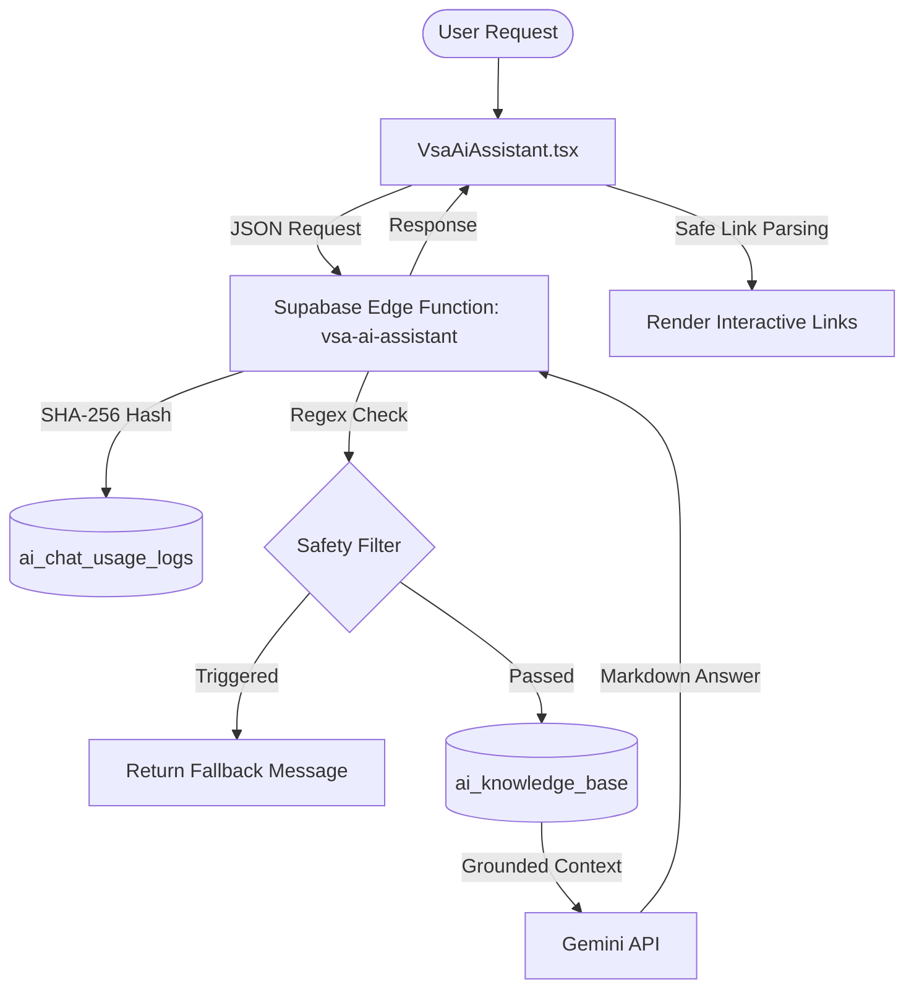

# Ask VSA AI Assistant Architecture & Privacy

This document outlines the architecture, safety filters, privacy safeguards, and link rendering of the Ask VSA AI assistant.

---

## 1. System Architecture

The Ask VSA assistant is a closed-loop Q&A agent that uses Gemini (`gemini-3.1-flash-lite` by default) to answer student questions using VSA-specific public information.


```mermaid
graph TD
    User([User Request]) --> UI[VsaAiAssistant.tsx]
    UI -->|JSON Request| Edge[Supabase Edge Function: vsa-ai-assistant]
    Edge -->|SHA-256 Hash| Logs[(ai_chat_usage_logs)]
    Edge -->|Regex Check| Safety{Safety Filter}
    Safety -->|Triggered| Fallback[Return Fallback Message]
    Safety -->|Passed| DB[(ai_knowledge_base)]
    DB -->|Grounded Context| Gemini[Gemini API]
    Gemini -->|Markdown Answer| Edge
    Edge -->|Response| UI
    UI -->|Safe Link Parsing| Render[Render Interactive Links]
```

* **Frontend UI Component:** [VsaAiAssistant.tsx](file:///Users/havyn/Documents/CS/vsa-website/src/components/features/ai/VsaAiAssistant.tsx)
* **API Endpoint (Edge Function):** [index.ts](file:///Users/havyn/Documents/CS/vsa-website/supabase/functions/vsa-ai-assistant/index.ts)
* **Knowledge Database Table:** `ai_knowledge_base`
* **RPC Grounding Function:** `match_ai_knowledge_base` (semantic search query vector matcher)
* **Usage Database Logs:** `ai_chat_usage_logs`
* **Feedback Logging:** `ai_feedback` table

---

## 2. Privacy & Data Guardrails

Ask VSA enforces strict data boundaries to ensure no sensitive, private, or admin-only information is exposed.

### Hashed Usage Logging (No PII)
- Client IP addresses and session IDs are hashed using a server-side **SHA-256** function before querying rate limits or writing logs.
- The raw text of conversations is **never stored** in the database usage log (`ai_chat_usage_logs`), maintaining full anonymity.

### Edge Function Safety Interceptors
The Edge Function uses regex checks in `asksForSensitivePrivateInfo()` to block input containing:
- Check-in codes or event attendance codes.
- Admin secrets, passwords, database names, or credentials.
- Environment variables or service keys.
- Requests for individual member emails, phone numbers, or rosters.
- Request records or private Drive storage links.

### System Prompt Constraints
The `SYSTEM_PROMPT` enforces:
- Answering strictly from the grounded knowledge snippets.
- Refusing to invent deadlines, event locations, point values, or dates if missing.
- Polite refusal when asked for private lineage details or roster entries, redirecting to the official VSA website pages.

---

## 3. Safe Link Rendering

Gemini outputs route suggestions in standard markdown format: `[Link Label](/path)`. The React frontend parses these links safely:
1. **Internal Routes:** Regex matches `[Label](/route)` and compiles them into React Router `<Link to="/route">` tags. This enables instantaneous, single-page transitions.
2. **External Routes:** HTTP/HTTPS links are compiled into `<a href="url" target="_blank" rel="noopener noreferrer">` tags.
3. **Safety Protection:** Scheme matching blocks arbitrary javascript (`javascript:` code execution) or raw unescaped HTML injection.

---

## 4. Fallback Mechanics

The widget sends at most four prior turns, with each turn capped at the Edge
Function's 500-character request limit. Full answers remain visible in the chat.
Error and rate-limit responses are excluded from history. Retry replaces the
failed question and response using the context that preceded that question.
Failures appear once in the conversation and are announced by one live region.

When live database data is unreachable, or when the AI does not find relevant public context, the assistant responds with:
> "Some live site data is unavailable right now. Check Instagram or Linktree for the newest updates."


## 5. Atomic admission and deployment

Before retrieval or Gemini work, `reserve_ai_quota` reserves capacity in one
PostgreSQL transaction with locks ordered global → IP → session. Both RPCs and
`ai_chat_quota_reservations` are service-role-only; client roles have no access.
Session and IP identifiers retain the existing SHA-256 hashing.

The rolling limits are 2 admitted attempts per session per 5 minutes, 5 per
session per 24 hours, 10 per IP per hour, and 50 per IP per 24 hours. Existing
usage logs remain included. Shared admission limits of 200 per hour and 2,000
per 24 hours cap work even when sessions are rotated or no IP is available.
Denied requests return the existing 429 response and do no retrieval/provider
work. A quota backend failure returns the friendly unavailable response.

Completion writes a usage log with the reservation's UUID and admission time.
Counts include the log or the outstanding reservation once, never both.
Reservations consume quota even after a crash, timeout, or provider failure;
they stop counting as each rolling window expires. Gemini has a 30-second
request deadline. No request text is added to the admission ledger. The shared
limits count admissions including fallbacks, not rejected-request log rows.

Apply `20261001000300_atomic_ai_quota.sql` manually **before** deploying
`vsa-ai-assistant`. Deploying the function first fails closed while its RPCs are
absent. The old function must be replaced promptly after the migration because
it does not reserve capacity. No new secrets or provider dependencies are needed.

Focused handler tests (fake HTTP backend; these do not prove SQL concurrency):

```bash
deno test --no-lock --allow-env --allow-net --import-map supabase/functions/vsa-ai-assistant/test-import-map.json supabase/functions/vsa-ai-assistant/quota.test.ts
```

Run the local PostgreSQL regression script only against a disposable database:

```bash
AI_QUOTA_TEST_DATABASE_URL=postgresql://... python3 supabase/functions/vsa-ai-assistant/quota_postgres_test.py
```

It never loads project environment files or defaults to a production connection.
